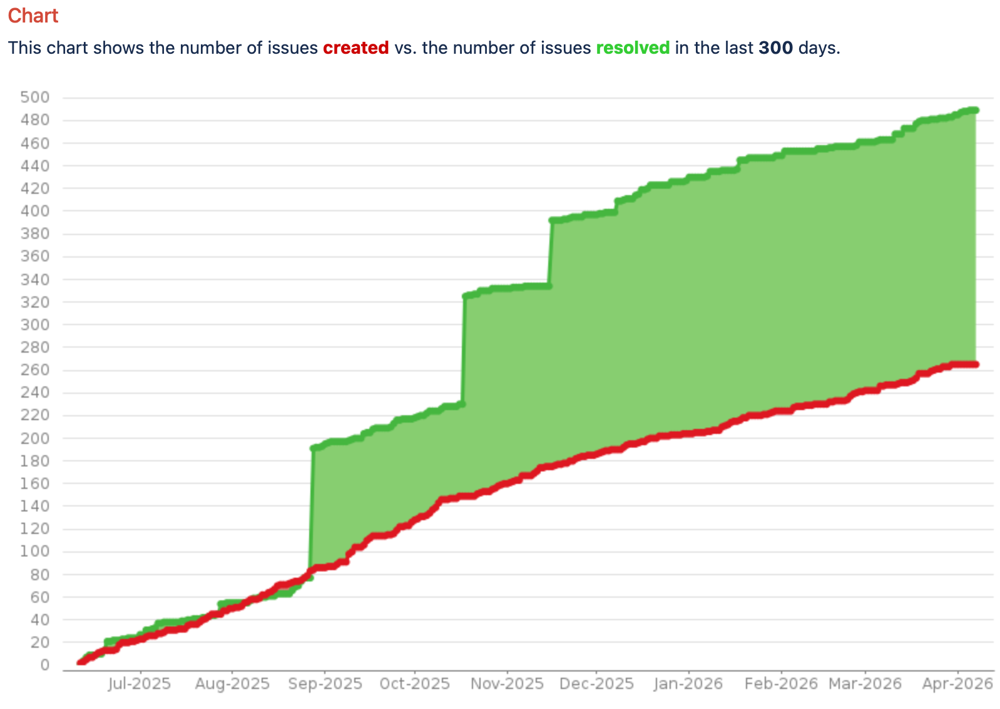

Software projects have the tendency to always grow out of proportion and most often
become hard to manage because of all the other tickets.
While this Jira automation is not a replacement for regular clean-ups and
refinements of your tickets, it definitely helped us to keep the clutter in the
project low.  

<!--more-->

A very common visualization of this clutter taking place can be seen in the following created vs resolved graph, taken froma real open source project.



Millions of POs and TPMs will likely be able to tell you, that this is not an observation that is limited to open source or due to sloppy engineers, it's simply one of the constant battles of project management.
I have seen it happen over and over in the last 25+ years.
Follow these steps to implement this neat little ticket cleanup automation.

Assuming your team name is `bubbles`, in a project called `BBLS`.

Create a rule with the name "Bubbles Deprecation"
Set the JQL to something like:
`updated <= 183d AND project = BBLS AND status not in (Closed, Done) AND component in (Bubbles, Test)`

Note that you might exclude Epics from above's JQL in case you never want to automatically close those - or maybe bugs? Your mileage may vary...

Add a step "Edit issue fields" and **only** set "additional fields" to

```json
{
    "update": {
        "labels": [
            {
                "add":  "BBLS_Deprecation_{{now.jqlDate}}"
            }
        ]
    }
}
```

Add an action to add a comment, for instance:
> This ticket has not been changed over the last 183 days and is therefore being rejected.
> If you believe this ticket still needs to be done, please lay out the case and reopen.

Add an action to transition the issue to `Closed`
